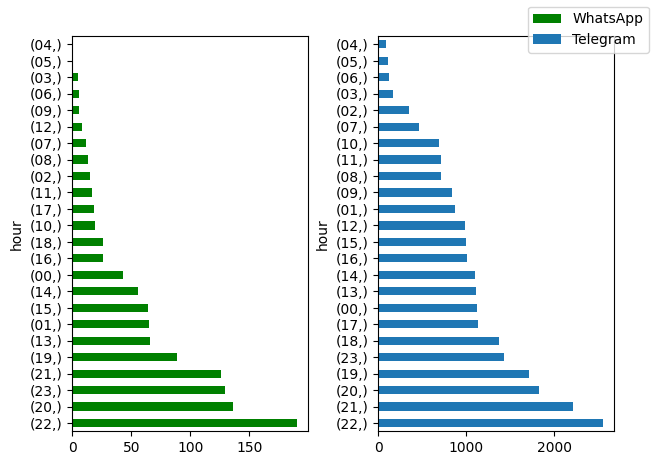

# WhatsApp and Telegram Chat Analysis.

It visualizes the most used words, hours texted, general sentiments by the other party.

# Files needed:

1. Exported Telegram Chat JSON file.

[How to export Telegram chat](https://www.maketecheasier.com/export-telegram-chat-history/)

2. Exported WhatsApp Chat text file.

[How to export WhatsApp chat](https://www.marca.com/en/lifestyle/how-to/2021/11/10/618bbe63ca4741b2138b4608.html)

# Screenshots

## Words

## Hours

## Sentiments

